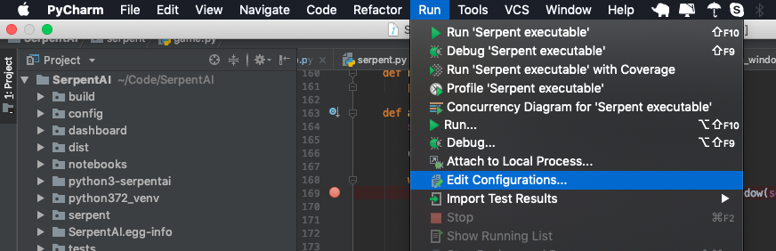
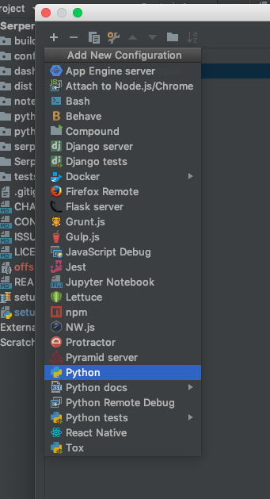
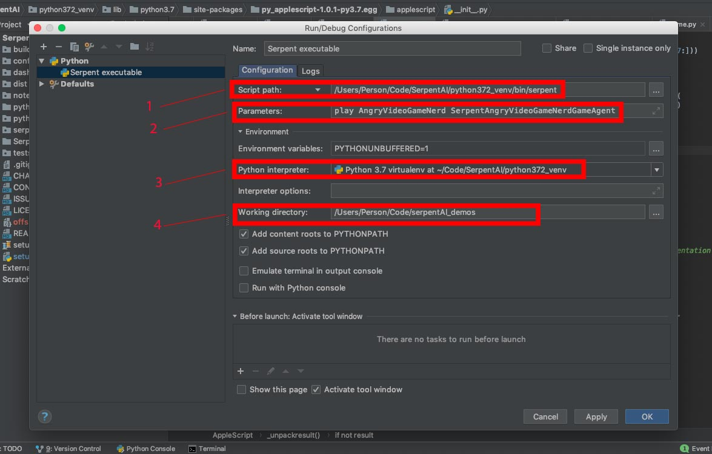
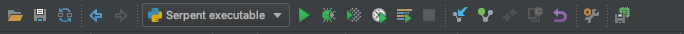
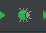
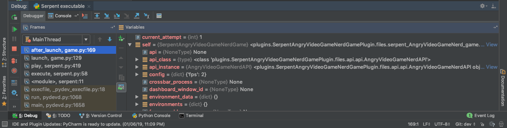

[SerpentAI](https://github.com/SerpentAI/SerpentAI) at this point has reached **EOL (End of life)** and is no longer being supported. So this article is a bit late. 
Thought I'd put it out anyway because of the effort spent on debugging the game agent and getting the framework to work. The framework installs and works relatively flawlessly 
on Ubuntu so if you're itching to try something out on SerpentAI, I would suggest Ubuntu for a less painful experience.   

In the interest of keeping this short and sweet, I'm going to assume you've followed the instructions on the SerpentAI wiki.

Serpent AI installation and hello world instructions:  
https://github.com/SerpentAI/SerpentAI/wiki

A good starting point here would be to use existing open sourced code for popular games. Check out the link below for Serpent AI plugins on
github. 
https://github.com/SerpentAI/SerpentAI/wiki/Community-Plugin-Showcase  

Once everything is installed and working, you should be able to run serpent via the command line. Something similar to what's below. If you've named your
plugin something else, use that instead. Your serpent play command should be somewhat similar to what's below.

```bash
serpent play <Game Name> <Generated Game Agent Name>
```

Example:  
```bash 
serpent play AngryVideoGameNerd SerpentAngryVideoGameNerdGameAgent
``` 
<br>

### Steps:  

Assuming you already have the relevant project/directory opened in PyCharm.

#### Click Run and then "Edit Configurations...".



#### Click the "+" symbol to add a new Python configuration. 



#### Setting up the configuration


 
1). **Script path**: If you've followed the Serpent AI wiki, you should have your virtual env up and running. The venv folder has the serpent
executable. It should be the same folder where you'd look for activate. 

```
<Path to Serpent AI folder>/<virtual env name>/bin/serpent
```  

2). **Parameters**: Should be the command and options you're looking to debug or run. 

So if what you'd type at the command line is ...
``` 
serpent play AngryVideoGameNerd SerpentAngryVideoGameNerdGameAgent 
``` 

This is what you'd put in the Parameters section. 
``` 
play AngryVideoGameNerd SerpentAngryVideoGameNerdGameAgent 
``` 

3). **Python Interpreter**: This section should point to your python venv environment. Add your venv to the project if isn't 
selectable here. 

4). **Working Directory**: This section should point to the directory where your SerpentAI plugin code resides.  

Once the above sections have been filled, click the "OK" button. You should now see a set 
of buttons similar to what's below. 



Set a breakpoint and click the 

A debugger window should now open up at the bottom of your IDE window.

  

### Useful Links
- [Serpent AI Github Repo](https://github.com/SerpentAI/SerpentAI/)
- [Serpent AI Official Wiki](https://github.com/SerpentAI/SerpentAI/wiki)
- [Serpent AI Plugin Showcase](https://github.com/SerpentAI/SerpentAI/wiki/Community-Plugin-Showcase)
