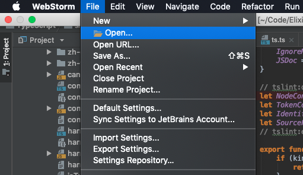
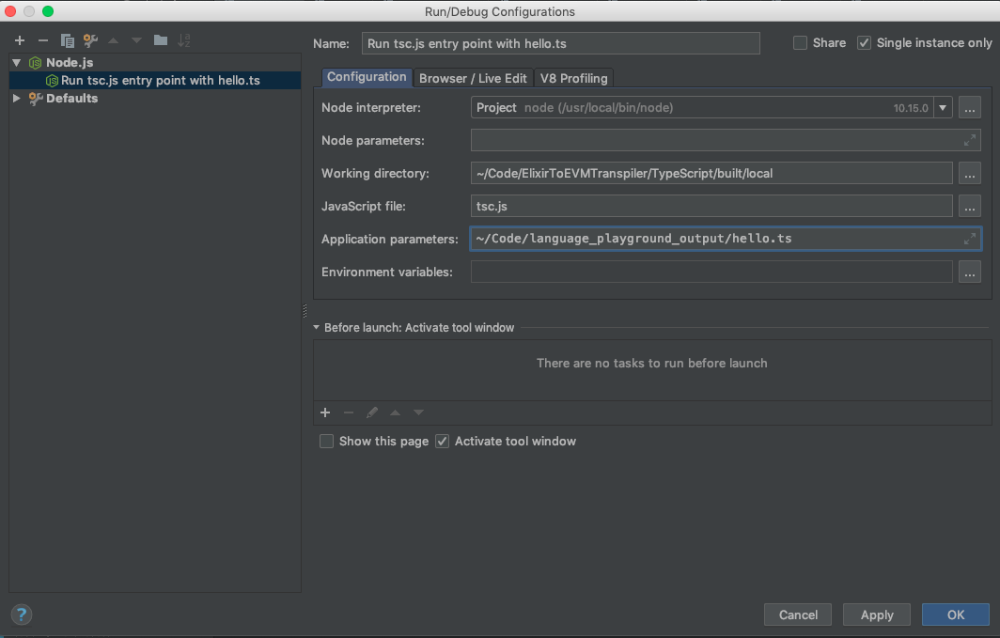
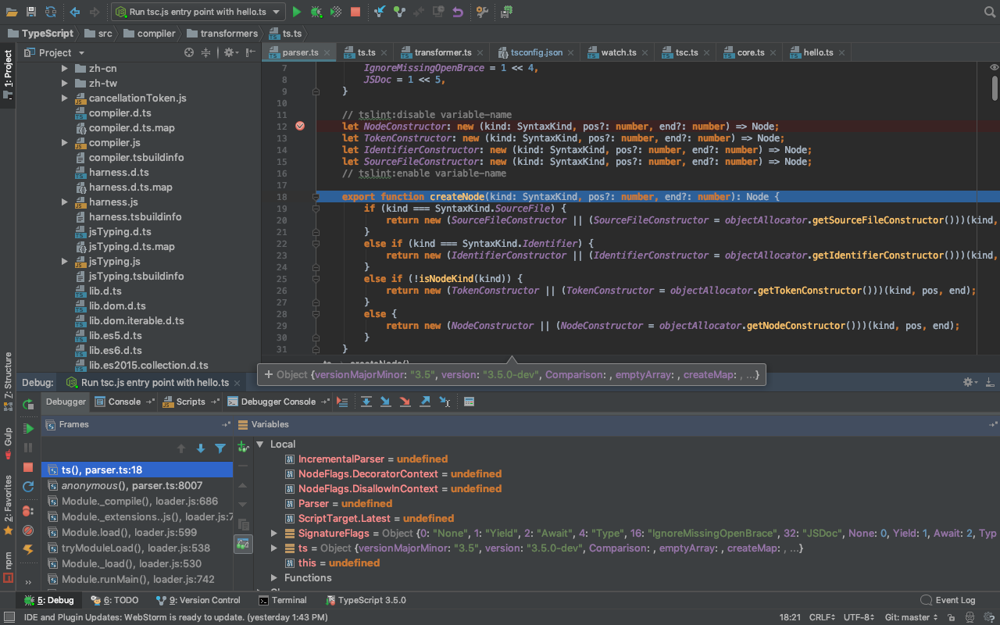

## with WebStorm


The world seems to be moving towards using TypeScript with NodeJS. TypeScript a typed superset of Javascript. Another way of 
looking at it, if you can pretend the ["Any"](https://github.com/Microsoft/TypeScript/blob/master/doc/spec.md#3.1) type does not 
exist, TypeScript almost feels like a strongly typed language.      

This blog post shows you how to go about setting up the debugger in WebStorm for server-side TypeScript projects. The instructions in 
this post should work if you're looking to debug the TypeScript compiler itself or your node js project that uses TypeScript. Those 
two are not exactly the same but for some reason I was tempted to spend time stepping through the TypeScript project to checkout 
TypeScript internals. I'll have to do a future blog post detailing problem solving and debugging a standard TypeScript node js project. 

#### Fetch the TypeScript source here:  
- [https://github.com/Microsoft/TypeScript](https://github.com/Microsoft/TypeScript)  

<br />

#### In case you're looking to debug client side applications written using TypeScript:  
- [https://www.jetbrains.com/help/idea/running-and-debugging-TypeScript.html](https://www.jetbrains.com/help/idea/running-and-debugging-TypeScript.html)

<br />

#### Debugging TypeScript using Visual Studio Code:
- [https://code.visualstudio.com/docs/TypeScript/TypeScript-debugging](https://code.visualstudio.com/docs/TypeScript/TypeScript-debugging)

<br />

### General steps to set up debugging for server-side TypeScript Applications
-- Add ``` "sourceMap":true ``` in the compilerOptions section of your tsconfig.json file.  
-- The tsconfig.json file should mention an outfile or output folder. Assume its ```<base directory>/build``` if not specified. The output 
directory is where the generated js files are located.  
-- In the Run > Edit Configuration window, click the + sign and choose Node.Js option.  
-- Add the output directory as working directory in the modal that pops up.  
-- Add the generated index.js or main.js file in the output folder in the javascript file field.  
-- If everything was done correctly, you should now be able to set breakpoints in your TypeScript code and hit them via 
the debugger.   

## Getting breakpoints to work within TypeScript compiler source code 
<br />

### Optional: Setup HelloWorld Typescript project.
 
If you already have typescript code you want to work with, there is no need to setup a hello world project. The typescript 
compiler needs to be transpiling something to hit break points and do its thing.  

Create a folder and change into it. It does not matter what the folder is called so feel free ot change "examples" into whatever
suits you best. 

```bash
mkdir examples && cd examples
```

Create a new file called "hello.ts" and paste in the below code.  

```typescript
interface Person {
    firstName: string;
    lastName: string;
}

function greeter(person: Person) {
    return "Hello, " + person.firstName + " " + person.lastName;
}

let user = { firstName: "Jane", lastName: "User" };

console.log(user)
```

Create another file in the same folder called "tsconfig.json". Copy Paste the contents below into it.

```json
{
  "compilerOptions": {
    "removeComments": false,
    "target": "es6",
    "module": "commonjs",
    "declaration": false,
    "sourceMap": true,
    "lib": [
      "es6",
      "scripthost"
    ],
    "strictNullChecks": true,
    "newLine": "lf",
    "types": ["node"]
  },
  "files": [
    "produceLKG.ts",
    "buildProtocol.ts",
    "processDiagnosticMessages.ts",
    "generateLocalizedDiagnosticMessages.ts",
    "configurePrerelease.ts",
    "word2md.ts"
  ]
}
```

<br />

### Clone and Setup the TypeScript repo

Clone the TypeScript repo from [https://github.com/Microsoft/TypeScript](https://github.com/Microsoft/TypeScript) and follow instructions 
to set it up. You preferably want this is another directory and not in the same directory you created in the previous step.

```bash
git clone https://github.com/Microsoft/TypeScript && cd TypeScript
```

Instructions to build the TypeScript compiler are included in the README.md but here's what you mainly need to do. Once you've 
changed into the TypeScript directory, install Gulp.js if you don't already have it.

```bash
npm install -g gulp
npm install
```

Finally to build the compiler - run

```bash
gulp local
```

Once that step is done - we can test out the compiler by running what's below. I'm assuming your hello.ts file is in 
the examples directory and just one level up. 

```bash
node built/local/tsc.js ../examples/hello.ts
```

The output of the above command should be a hello.js file. Don't expect to see the output of the code. Remember this is 
the compiler, so if the hello.js file was generated successfully then all is well and everything is working as it should.

### Open TypeScript source in WebStorm

Open your local TypeScript repo in WebStorm. This should be fairly straightforward. Either use Open button on the Welcome Screen or choose Open 
from the File menu.



Refer to [this link](https://www.jetbrains.com/help/webstorm/opening-reopening-and-closing-projects.html) for 
a more detailed walk-through of opening projects in WebStorm. 

### Setting up Run > Edit Configuration 

Time to set up the run/debug configuration.  

##### Node interpreter 
Should point to your Node interpreter of choice. I used version ```10.15.0```. Anything 10 and above should work just fine.  

##### Working directory 
Should point to your output folder. Unless you've changed something, this should be ```built/local```.  

##### Javascript file 
Should point to the generated tsc.js file in the output directory. This file should have been generated when you ran 
gulp local.  

##### Application parameters 
Should point to the hello.ts file you generated at the beginning.  

Click OK once you're done.



<br />

### The Test Run

You're all set to do a test run. Set a breakpoint in parser.ts which should be at 
```TypeScript > src > compiler > parser.ts``` and hit the debugger button. The debugger window should open up and show you something similar
to what's below. 


    
### Useful Links

- [TypeScript Official Github Repo](https://github.com/Microsoft/TypeScript)
- [Jetbrains - creating custom projects in WebStorm](https://www.jetbrains.com/help/webstorm/creating-projects-in-product.html)
- [Debugging a client-side TypeScript application](https://www.jetbrains.com/help/webstorm/running-and-debugging-typescript.html#ws_ts_run)
- [Yeoman Generators for Typescript Applications](https://yeoman.io/learning/resources.html)

### Cover Image Source
Image Source: [Flickr](https://www.flickr.com/photos/146269332@N03/47106910624/in/photolist-2eLFemd-nY6vr9-MsyuhK-F2LmZN-WGWa1r-9fhnG9-GnT9Sj-q4v4k6-dpQPuy-TbxF2k-apL9WG-Nx5Xky-pM6nSe-2dbhxzr-c1GNPq-29wk6Vd-29iXfLq-MsNKVW-V5F1PA-KUGpmv-2dQfn2D-6snC1M-MsNKqh-jSeU32-mjhDwB-6td7T5-UXHBfJ-28veavC-ekV1wX-2agmFMS-UhqRDK-ekV1na-qwM8ii-28veaB9-edWUay-bCTfAn-buF9PV-ekV19D-ekUZVK-22BHK3U-QiKijz-QZxbZS-29iXfrN-7ioHwi-MtoYu4-2dZrD99-Sdz4Q3-JbLWRT-KUGqsD-jrETdg)